# :desktop_computer: IRIS - 윈도우 데스크탑용 AI 비서


## :zap: IRIS 설치파일 다운로드 링크 : [IRIS](http://j8b102.p.ssafy.io/)

## :movie_camera: 소개 영상 : [UCC 링크](https://youtu.be/0q725RXhRio)

## ✔ 프로젝트 진행 기간

2022.02.20(월) ~ 2022.04.07(금)

SSAFY 8기 2학기 특화프로젝트 >> PC용 음성인식 인공지능 비서 - IRIS

</br>

## ✔ 기획의도

전세계적으로 AI 비서 시장이 성장하고 있는 가운데 한국에서 윈도우 데스크탑용 AI 비서 서비스는 사용하기 어려운 실정입니다. 삼성에서 노트북에 빅스비를 제공하고 있으나 최신 제품만 지원하고 있으며 pc를 원활하게 조작하기 위해서는 부가적인 서비스를 설치해야 한다는 단점이 존재합니다. 이러한 불편함을 해소하고 자율성이 높은 AI 비서 서비스를 만들고자 IRIS를 개발하였습니다.

“****국내 AI 스피커 보급률 15%...반려가전 가능성 충분****”

[](https://www.etnews.com/20221011000211)[국내 AI 스피커 보급률 15%...반려가전 가능성 충분 - 전자신문](https://www.etnews.com/20221011000211)

“**일상에 스며든 AI 음성인식 서비스**”

[](https://www.dailypop.kr/news/articleView.html?idxno=58913)[[그것이 궁금] 일상에 스며든 AI 음성인식 서비스 - 데일리팝](https://www.dailypop.kr/news/articleView.html?idxno=58913)

</br>

## ✔ 개요

IRIS라는 AI 비서 서비스는 **다양한 기종 지원**과 **높은 자율성**이라는 두 가지를 목표로 개발되었습니다. 기종 관계 없이 윈도우 운영체제를 가진 데스크탑 또는 랩탑에서 사용할 수 있도록 윈도우 내 기본적인 기능들을 활용하였습니다. 또한, 사용자가 원하는 명령어를 직접 커스터마이징하고 커스텀 된 명령어를 조합할 수 있는 기능을 제공하여 자율성을 높이기 위해 힘썼습니다.  IRIS는 사용자의 말을 알아듣기 위해 Google Speech API, 그리고 KoSpeech를 기반으로 한 IRIS STT 학습모델(추후 공개 예정)을 사용합니다. 그에 더해 Glow-TTS를 사용하여 사용자에게 음성으로 반응할 수 있는 기능을 추가하였습니다. 앞으로 IRIS의 성장을 기대해주세요.

</br>

## ✔ 주요 기능

---

- ### 사용자 지정 명령어 등록
  
  - 사용자가 가진 응용 프로그램을 간단하게 등록할 수 있습니다.
  - 등록된 프로그램을 사용자가 음성으로 켜고 끌 수 있습니다.
  - 특정 사이트의 url을 등록하면 명령어로 켜고 끌 수 있습니다.

- ### 사용자 지정 명령어 조합
  
  - 사용자가 등록한 커스텀 명령어를 조합할 수 있습니다.
  - 하나의 명령어로 프로그램A 끄고, 프로그램B를 켜고, C를 캡쳐할 수 있습니다.
  - 등록된 조합 명령어는 사용자가 원하는 대로 생성, 삭제할 수 있습니다.

- ### 시동어 설정
  
  - 기본 시동어는 이리스로 '이리스'라고 부르면 AI 비서가 대기합니다.
  - 시동어의 이름은 원하는 이름으로 변경할 수 있습니다.

</br>

## ✔ 주요 기술

---

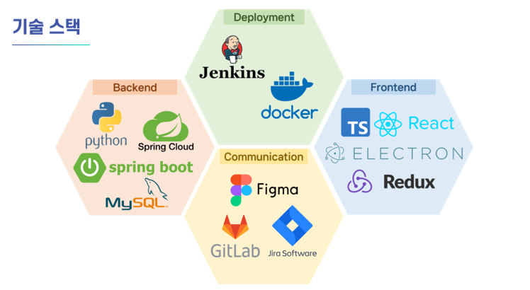

**Server - Spring**

- IntelliJ IDE
- OpenJDK 1.8
- Springboot 2.7.9
- Spring Framework 5.3.24
- Spring Data JPA
- Spring Security 5.7.6
- Swagger 3.0.0
- Spring Gradle 7.6
- Spring Cloud(2021.0.5)
- MySQL 8.0.32

**Client**

- Visual Studio Code IDE
- React 18.2.0
- Node.js 18.12.1
- TypeScript 4.9.5
- Redux 8.0.5
- Electron 23.1.2

**CI/CD**

- AWS EC2
  - Ubuntu 20.04 LTS
  - Docker 20.10.12
- Jenkins 2.375.1
- SSL

**인공지능**

- Google Speech API

- KoSpeech

- Glow-TTS

## ✔ 프로젝트 파일 기본구조

---

### Server - MSA 서비스 기본구조

```
server
  ├── config
  ├── controller
  ├── dto
  ├── entity
  ├── repository
  └── service
```

</br>

### Client

```
Client
  ├── .prettierrc
  ├── assets
  ├── misc
  │   └── window
  │       ├── component
  │       ├── windowPreload
  │       └── IPC API
  ├── package-lock.json
  ├── package.json
  ├── tools
  │   ├── forge
  │   └── webpack
  └── src
      ├── common
      ├── renderer
      │  ├── components
      │  │   ├── Alert
      │  │   ├── Response
      │  │   └── SideBar
      │  └── pages
      │      ├── settings
      │      └── start
      ├── fonts
      ├── functions
      │  └── pythoncode
      ├── main
      ├── redux
      └── typings
```

</br>

### ERD

---

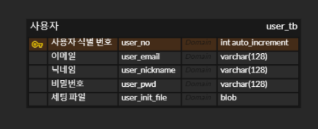

</br>

## ✔ CI/CD

---

### MSA구조에 맞게 프로젝트 단위마다 Docker 컨테이너로 나누어 관리, 젠킨스를 통해 자동 빌드, 배포 중

---

</br>

## ✔ 협업 툴

---

- GitLab
- Notion
- JIRA
- MatterMost
- Webex

</br>

## ✔ 협업 환경

---

- Gitlab
  - 코드의 버전을 관리
  - Git Flow 브랜치 전략 사용
  - 팀원과의 소통을 위해 설정한 Git Convention을 따름
- JIRA
  - 매주 월요일 목표를 설정하여 Sprint 진행
  - 업무의 할당량을 정하여 Story Point를 설정하고 해당하는 컴포넌트와 버전을 명시함
- 회의
  - 매일아침 30분씩 스크럼을 통해 진행사항 공유
  - 긴급 안건이 있는 경우 별도의 회의를 진행함
- Notion
  - 회의가 있을때마다 회의록을 기록하여 보관
  - 전날 진행한 사항과 진행할 사항 등에 관한 스크럼 사항 기록
  - 컨벤션 정리
  - 간트차트 관리
  - 기능명세서, API 명세서 등 모두가 공유해야 하는 문서 관리

</br>

## ✔ 팀원 역할 분배

---


##### BACK-END

- **김주성** : 팀장, KoSpeach 모델 학습, 스프링 환경 구축, 파이썬 패키징 등

- **정도형**: DevOps, 명령어 분기 처리, 형태소 분석, Google STT, Apigateway 구현, 파이썬 패키징 등

- **김태수**: Glow-TTS 모델, hifiGAN 학습, 일렉트론-파이썬 연동, 파이썬 패키징 등

- **정연화**: Spring Security 구현, JWT, user 관련 API 구현, 일렉트론 - 파이썬 연동 등

</br>

##### FRONT-END

- **김성훈** : 발표자, 와이어 프레임 제작, 유저 서비스 구현, 일렉트론 - 리액트 셋팅, TTS 목소리 제공 등

- **배성현**: UCC 제작, 와이어 프레임 제작, IRIS 설정 페이지 구현,  일렉트론 API 구현, STT 연동 등

- **정연화**: 와이어 프레임 수정, 조합 명령어 구현, ini 파일 구현, 입출력장치 연동 등
  
  <div>
  </br>
  </div>

## ✔ 프로젝트 산출물

---

- [주제선정](https://www.notion.so/93953f5d66fe47388ff5fda8cdebed64?v=cd8c80abbcb946ca9ec5ddab2eca100a&pvs=4)
- [API 명세서](https://www.notion.so/API-e00642bfa8ab4620a2fb1abde1652d5a?pvs=4)
- [요구사항 명세서](https://www.notion.so/27e12945e60c457e98812feb1822f537?pvs=4)
- [UI/UX](https://www.figma.com/file/cdyE0VSRLssipGI7mSzUpq/%ED%8A%B9%ED%99%94-%ED%94%84%EB%A1%9C%EC%A0%9D%ED%8A%B8-AI-%EC%9D%8C%EC%84%B1-iris?t=rbI9Pg5ef4ZANKbF-6)
- [컨벤션](https://www.notion.so/Code-Convention-6a009ec96f7e40c28ba59d955f245919?pvs=4)
- [API](https://www.notion.so/API-e00642bfa8ab4620a2fb1abde1652d5a?pvs=4)
- [ERD](https://www.erdcloud.com/d/i3HWjQmaeuyLtztyH)
- [회의록](https://www.notion.so/9179543e084c4b959f3a067b8e4d57fe?pvs=4)
- [시스템 구조도](https://sugared-open-363.notion.site/13f2d07f818c43a8b7ec561dcbb9de42)

</br>

## :globe_with_meridians: IRIS 서비스 화면

### 랜딩 화면

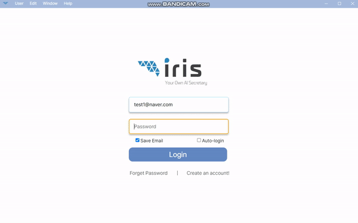

* 로그인 후 랜딩하는 화면입니다.


### 메인 화면

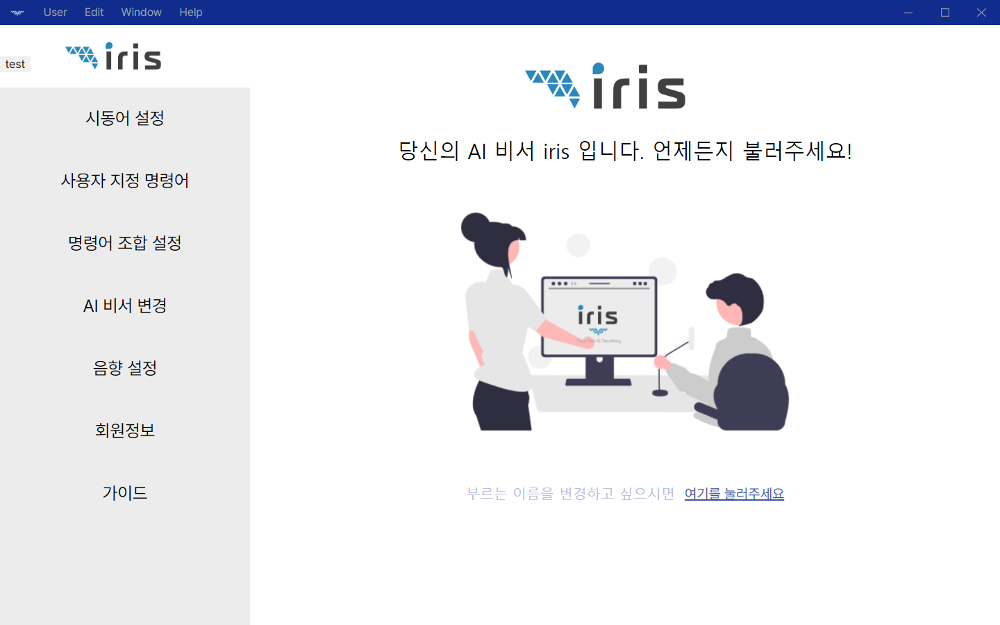

- IRIS 서비스 메인화면
- 사이드 메뉴바를 활용할 수 있습니다.


### 회원가입

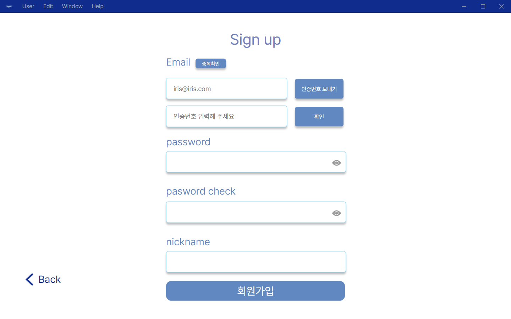

- 회원 가입을 진행할 수 있습니다.


### 시동어 설정

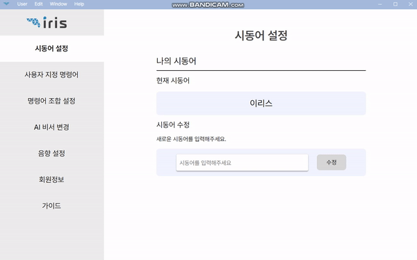

* 현재 설정되어있는 시동어를 확인할 수 있습니다.
- 시동어를 수정할 수 있습니다.


### 사용자 지정 명령어

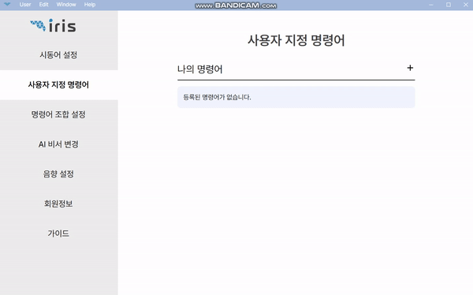

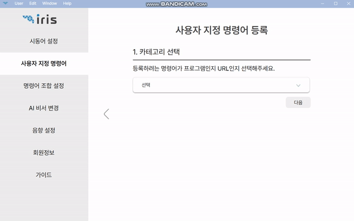

* 현재 지정되어있는 사용자 지정 명령어를 확인할 수 있습니다.

* 세 단계를 통해 사용자 지정 명령어를 등록할 수 있습니다.

* 설치되어있는 응용 프로그램과 URL을 등록할 수 있습니다.


### 명령어 조합 설정

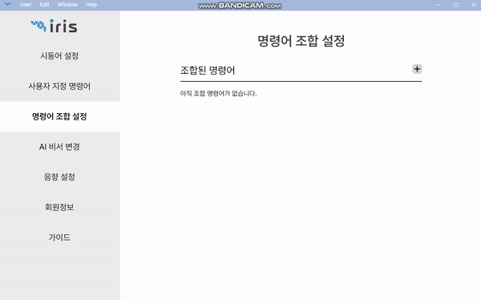

* 만들어둔 사용자 지정 명령어를 조합하여 한 번에 호출할 수 있습니다.


### AI 비서 변경

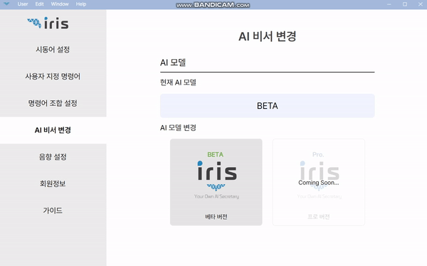

* AI비서의 모델을 변경할 수 있습니다.

* 현재는 BETA 버전으로만 실행 가능합니다.


### 음향 설정

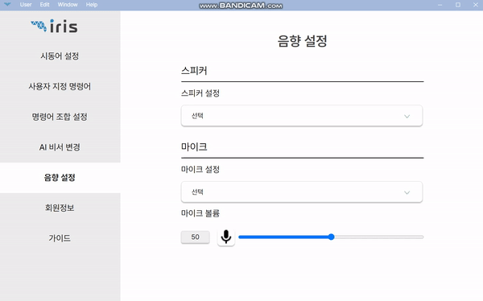

* 이리스를 사용하는 마이크, 스피커 스트림을 변경할 수 있습니다.


### 회원 정보 수정

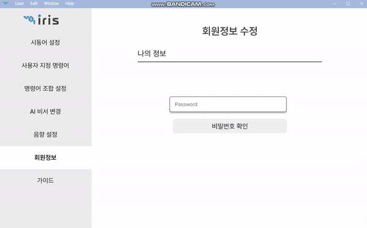

* 비밀번호로 자신을 인증한 후 회원 정보를 수정할 수 있습니다.


### 가이드 화면

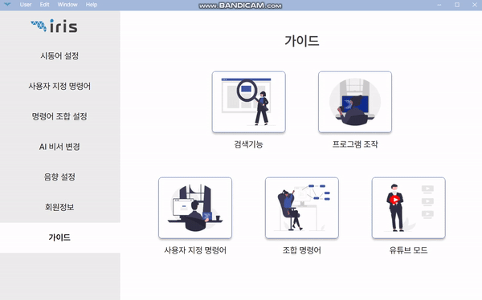

* 사용자의 편의를 위한 iris 가이드를 제공합니다.

---
