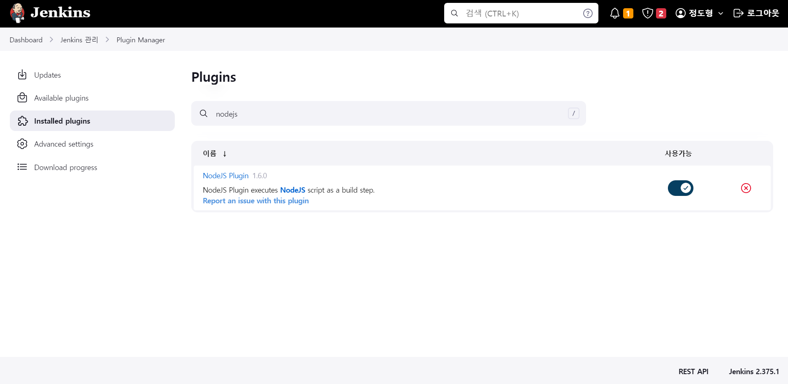

# 서버 환경 배포

## **목차**

1. [프로젝트 개발 환경](https://www.notion.so/1-842ca297d1c34fd8bc3f3e73a454ce99)
2. [EC2 설정](https://www.notion.so/1-842ca297d1c34fd8bc3f3e73a454ce99)
3. [Jenkins 설정](https://www.notion.so/1-842ca297d1c34fd8bc3f3e73a454ce99)
4. [Jenkins Build 완료 화면](https://www.notion.so/1-842ca297d1c34fd8bc3f3e73a454ce99)
5. [Back-End DockerFIle](https://www.notion.so/1-842ca297d1c34fd8bc3f3e73a454ce99)
6. [Port 정리](https://www.notion.so/1-842ca297d1c34fd8bc3f3e73a454ce99)

## 1. 프로젝트 개발 환경

### 형상 관리

- GitLab

### 이슈 관리

- Jira

### 커뮤니케이션

- Mattermost
- Webex
- Notion

### OS

- Windows 10

### UI/UX

- Figma

### IDE

- IntelliJ Build #IU-223.8214.52, built on December 20, 2022
- Visual Studio Code Version 10.0.19045.2364

### DataBase

- MySQL 8.0.32

### Server

- AWS EC2

### 배포

- Jenkins 2.375.1

### Front-End

- Electron
- React
- Node.js
- TypeScript

### Back-End

- OpenJDK 1.8
- SpringBoot 2.7.7
- Spring Framework 5.3.24
- Spring Security 5.7.6
- Python 3.8.5

## 2. EC2 설정

1. apt 업데이트
    
    `apt-get update`
    
2. Docker 설치
    
    `apt-get install docker.io`
    
3. 도커 데몬 실행
    
    `systemctl start docker`
    
4. Docker Jenkins Image 다운로드
    
    `docker pull jenkins/jenkins:2.375.1`
    
5. `docker run -d --name jenkins --env JENKINS_OPTS = --httpPort=8888 -p 8888:8888 -v /jenkins:/var/jenkins_home -v /usr/bin/docker:/usr/bin/docker -v /var/run/docker.sock:/var/run/docker.sock -u root jenkins/jenkins:2.375.1`
위 명령어를 통해 젠킨스 컨테이너의 이름을 jenkins로 설정, 젠킨스의 내부 포트번호를 8888번으로 설정 후 외부 포트 8888번과 포트포워딩, 젠킨스 컨테이너 내부의 /var/jenkins_home 폴더와 EC2 의 /jenkins 폴더를 볼륨 마운트, Jenkins 내부에서 Docker를 사용하기 위해 (Docker out of Docker) 볼륨 마운트, jenkins/jenkins:2.375.1 도커 이미지로 도커 컨테이너 실행
6. Docker MySQL Image 다운로드
    
    `docker image pull mysql`
    
7. MySQL 실행
    
    `docker run --name mysql -e MYSQL_ROOT_PASSWORD={루트 패스워드 입력} -d -p 3306:3306 mysql`
    

## 3. Jenkins 설정

1. [http://ip:6000/](http://ip:6000/) 로 젠킨스 홈페이지 진입 후 패스워드창에 docker log jenkins 를 입력해서 얻어온 키값 입력
    
    ```
    *************************************************************
    *************************************************************
    *************************************************************
    
    Jenkins initial setup is required. An admin user has been created and a password generated.
    Please use the following password to proceed to installation:
    
    이곳에 키 값이 나옵니다.
    
    This may also be found at: /var/jenkins_home/secrets/initialAdminPassword
    
    *************************************************************
    *************************************************************
    *************************************************************
    ```
    

1. Jenkins 관리 → Plugin Manager에서 NodeJS Plugin 설치
    
    
    

1. Jenkins 관리 → Plugin Manager에서 GitLab 관련 Plugin 설치
    
    
    

1.  Jenkins 관리 → Global Tool Configuration에서 NodeJS 항목 추가
    
    
    

1. WebHook을 위한 Credential 설정
    - ID는 GItLab ID
    - Password는 Gitlab의 Project access Token
    
    
    
2. Jenkins 새로운 Item 만들기
    - jenkins 프로젝트 이름 입력 후 Pipeline으로 생성
    - Back-End 프로젝트 갯수만큼 Item 생성
    
    
    

1. Item GitLab 설정
    - Gitlab webhook 옵션 체크
        
        
        
    
    - 하단의 [고급] 버튼 클릭 후 Generate 버튼을 클릭하여 Secret Key 생성 후 저장
        
        
        
    
2. 파이프라인 스크립트 입력(Back-End)
    
    ```jsx
    pipeline {
        agent any
    
        stages {
            stage('Pull') {
                steps {
                    git branch: '{WebHook을 설정한 브랜치를 입력하세요.}', credentialsId: '{생성한 Credential의 ID를 입력하세요.}', url: '{이곳에 Gitlab의 url을 입력하세요.}'
                }
            }
            
            stage('springboot build'){
                steps {
                    dir('{프로젝트의 빌드 파일이 있는 경로를 입력하세요.}'){
                        sh 'ls -l'
                        sh 'chmod +x gradlew'
                        sh './gradlew clean build -x test'
                    }
                    
                }
            }
            
            stage('Build') {
                steps {
                    dir('{프로젝트의 빌드 파일이 있는 경로를 입력하세요.}'){
                    sh 'docker build -t {생성할 도커 이미지의 이름을 입력하세요.} ./'
                    }
                }
            }
            
            stage('Deploy') {
                steps{
                    
                    sh 'docker ps -f name={컨테이너 이름} -q | xargs --no-run-if-empty docker container stop'
                    sh 'docker container ls -a -fname={컨테이너 이름} -q | xargs -r docker container rm'
                    sh 'docker images --no-trunc --all --quiet --filter="dangling=true" | xargs --no-run-if-empty docker rmi'
                    sh 'docker run -d --name {실행할 컨테이너 이름} -p 8000:8000 {생성한 도커 이미지의 이름}'
                }
            }
    
           stage('Finish') {
                steps{
                    sh 'docker images -qf dangling=true | xargs -I{} docker rmi {}'
                }
            }
        }
    }
    ```
    
3. 위와 같은 과정으로 Item 생성 후 파이프라인 스크립트 입력(Back-End)
    
    ```jsx
    pipeline {
        agent any
    
        tools {
            nodejs "{Plugin 설치 후 설정한 Nodejs의 이름}"
        }
    
        stages {
            stage('Pull') {
                steps {
                    git branch: '{WebHook을 설정한 브랜치를 입력하세요.}', credentialsId: '{생성한 Credential의 ID를 입력하세요.}', url: '{이곳에 Gitlab의 url을 입력하세요.}'
                }
            }
            
            stage('React Build') {
                steps {
                    dir('{리액트 빌드 폴더의 경로를 입력하세요.}'){
                        sh 'npm install -g yarn'
                        sh 'yarn --cwd ./ install --network-timeout 100000'
                        sh 'yarn --cwd ./ build'
                    }
                    
                    
                }
            }
            
            stage('Build') {
                steps {
                    dir('{Dockerfile이 있는 경로를 입력하세요.}'){
                        sh 'docker build -t {생성할 도커 이미지의 이름을 입력하세요} ./'
                    }
                }
            }
            
            stage('Deploy') {
                steps{
                    sh 'docker ps -f name={컨테이너 이름} -q | xargs --no-run-if-empty docker container stop'
                    sh 'docker container ls -a -fname={컨테이너 이름} -q | xargs -r docker container rm'
                    sh 'docker images --no-trunc --all --quiet --filter="dangling=true" | xargs --no-run-if-empty docker rmi'
                    sh 'docker run -d --name {컨테이너 이름} -p 80:80 {생성한 도커 이미지의 이름}'
                    
                }
            }
    
           stage('Finish') {
                steps{
                    sh 'docker images -qf dangling=true | xargs -I{} docker rmi {}'
                }
            }
        }
    }
    ```
    
4. Gitlab Webhook 설정
    
    
    

## 4. Jenkins 빌드 완료 화면


## 5. Back-End DockerFIle

- JAR 파일의 경로 관련 설정, java -jar /app.jar로 도커 contianer가 실행될 때 프로젝트가 동작하도록 설정

```jsx
FROM openjdk:8
ARG JAR_FILE_PATH=build/libs/battle-service-0.0.1-SNAPSHOT.jar
COPY ${JAR_FILE_PATH} app.jar
EXPOSE 9002
ENTRYPOINT ["java", "-jar", "/app.jar"]
```

## 6. Port 정리

| Port | Service |
| --- | --- |
| 9000 | user-service |
| 9002 | log-service |
| 7777 | tts-service |
| 3306 | mysql |